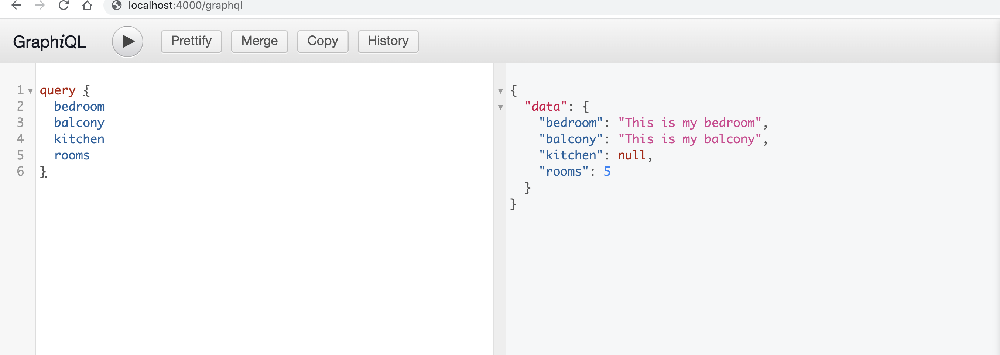

### This is basic graphQL application
### Following the guide you can create simple graphQL plyaground to creare and execute your API query.

### Run the application localy

```
npm run start
```
### Application will start running locally

```
http://localhost:4000/graphql
```



### Useful Resource link

1. https://graphql.org/
2. https://www.apollographql.com/docs/react/


### What we must know:

1. schema (describe about working of API and its structure). It has 2 types.
 a. Query (to fetch and read data)
 b. mutation  (to update and delete data)

 query + mutation  = CRUD operarion
 
2. resolvers ()
